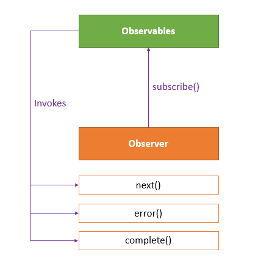
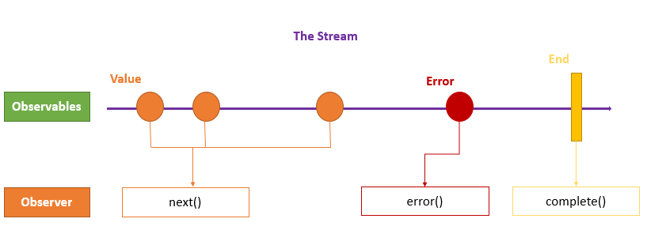
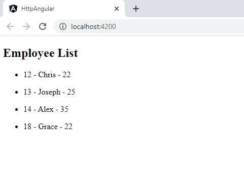
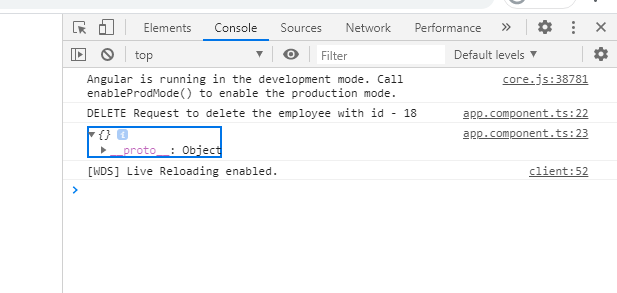
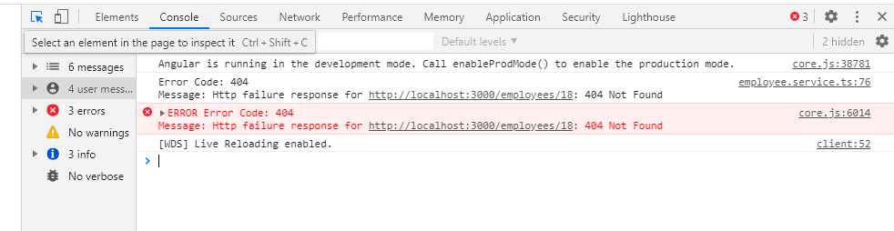
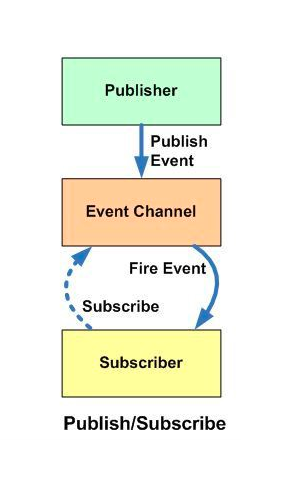

# Observables

Observables provide support for passing messages between parts of your application. We can use observables for event handling, asynchronous programming, and handling multiple values.

The obserser pattern is similar to the [publish/subscribe](https://en.wikipedia.org/wiki/Publish%E2%80%93subscribe_pattern) design pattern. Observables define a function for publishing values, but it is not executed until a consumer subscribes to it. The subscribed consumer then receives notifications until the function completes, or until they unsubscribe.

An observable can deliver multiple values of any type (literals, messages, or events). The API for receiving values is the same whether the values are delivered synchronously or asynchronously and the setup and the logic are both handled by the observable. We'll only concentrate on subscribing to consume values, and when done, unsubscribing. The observer subscribes to the observable to receive the value. To execute the observable we have created and begin receiving notifications, we call its `subscribe()` method, passing an observer. The `unsubscribe()` method is called to stop receiving notifications.  



The observer defines three callback methods -  `next()`, `error()`, and `complete()`. The observable invokes the `next()` callback whenever the value arrives in the stream. It passes the value as the argument to the next callback. If the error occurs, then the `error()` callback is invoked. It invokes the `complete() `callback when the stream completes.



**Example:** 
```typescript
import {Observable, of } from "rxjs";

export class AppComponent {
// Create simple observable that emits three values
myObservable = of(1, 2, 3);

// Create observer object
myObserver = {
  next: x => console.log('Observer got a next value: ' + x),
  error: err => console.error('Observer got an error: ' + err),
  complete: () => console.log('Observer got a complete notification'),
};

// Execute with the observer object
constructor(){
  this.myObservable.subscribe(this.myObserver);
}
// Logs:
// Observer got a next value: 1
// Observer got a next value: 2
// Observer got a next value: 3
// Observer got a complete notification
  
}
```

> **NOTE:**  The `of(...items)`returns an *Observable instance* that synchronously delivers the values provided as arguments.

### Promises vs Observables

In Angular, we can use either Promises or Observables for handling asynchronous data. 

**The difference is** - a Promise emits a single value while Observable can emit multiple values. So, while handling a HTTP request, a Promise can manage a single response for the same request, but if there are multiple responses to the same request, then we have to use an Observable.

**Example:** 
```typescript
const promise = new Promise((data) =>{ 
    data(1);
    data(2);
    data(3);    }).then(element => console.log('Promise '+ element));
// Logs:
// Promise 1

const observable = new Observable((data) => {
    data.next(1);
    data.next(2);
    data.next(3);   }).subscribe(element => console.log('Observable ' + element));

// Logs:
//Observable 1
//Observable 2
//Observable 3
```

## RxJS - Subjects

**R**eactive E**x**tensions for **J**ava**S**cript([RxJS](https://rxjs.dev/guide/overview)) is a framework for reactive programming using observables that makes it easier to write asynchronous code.

An RxJS Subject is a special type of Observable that allows values to be multicasted to many Observers.

By default an RxJS Observable is unicast, i.e. each subscribed observer has an independent execution of the Observable, whereas multicast means that the Observable execution is shared by multiple Observers. 

Every Subject is an Observer. It is an object with the methods `next(v)`, `error(e)`, and `complete()`. To feed a new value to the Subject, just call `next(theValue)`, and it will be multicast to the Observers registered to listen to the Subject. We subscribe to the Subject to recieve values normally.


**Example:**  Here, we have two Observers attached to a Subject and we feed some values to the Subject.

```typescript
import { Subject } from "rxjs";
export class AppComponent implements OnInit{
  ngOnInit(){
      const subject = new Subject();
      //First Observer
      subject.subscribe({
         next: (data) => console.log('First observer prints '+ data)
      });
      subject.next(1);
      //Second Observer
      subject.subscribe({
         next: (data) => console.log('Second observer prints '+ data)
      });
      subject.next(34);
      subject.next(14);
   }
//Logs:
//First observer prints 1
//First observer prints 34
//Second observer prints 34
//First observer prints 14
//Second observer prints 14
}
```
In this example, we have two observers for the subject that returns data values. If we notice, the second observer did not receive the very first `next` value because the subject simultaneously holds and efficiently distributes the values according to scope and definition. 

## Subject Variants

There are 3 subject variants:

### Behavior subject
It used to temporarily store the current data value of any observer declared before it. 
**Example:**
```typescript
ngOnInit(){
   const subject = new BehaviorSubject(0);
   //First Observer
   subject.subscribe({
      next: (data) => console.log('First observer prints '+ data)
   });
   subject.next(1111);
   subject.next(2222);
   //Second Observer
   subject.subscribe({
      next: (data) => console.log('Second observer prints '+ data)
   });
   subject.next(3333);
}
//Logs:
//First observer prints 0
//First observer prints 1111
//First observer prints 2222
//Second observer prints 2222
//First observer prints 3333
//Second observer prints 3333
```
Here, subject stores last data value '2222' and then reports by the new observer even though it was defined after the reference to it. Also, the new constructor takes an initial value.

### Replay subject

Replay Subject provides a option to choose how many values we want to emit from the last observer. This subject stores and then passes the last specificed option values to the new observer.
**Example:**
```typescript
ngOnInit(){
   const subject = new ReplaySubject(2);
   //First Observer
   subject.subscribe({
      next: (data) => {
         return console.log('First observer prints ' + data);
      }
   });
   subject.next(1111);
   subject.next(2222);
   //Second Observer
   subject.subscribe({
      next: (data) => {
         return console.log('Second observer prints ' + data);
      }
   });
   subject.next(3333);
}
//Logs:
//First observer prints 1111
//First observer prints 2222
//Second observer prints 1111
//Second observer prints 2222
//First observer prints 3333
//Second observer prints 3333
```
Here, subject stores last 2 data values ('1111' & '2222') and then reports them to the new observer.

### Async subject
A Async Subject emits the last value to observers when the sequence is completed.
```typescript
ngOnInit(){
   const subject = new AsyncSubject();
   //First Observer
   subject.subscribe({
      next: (data) => console.log('First observer prints '+ data)
   });
   subject.next(1);
   subject.next(2);
   //Second Observer
   subject.subscribe({
      next: (data) => console.log('Second observer prints '+ data)
   });
   subject.next(3);
   subject.complete();
}
//Logs:
//First observer prints 3
//Second observer prints 3
```
Here, we execute the subject only after a `complete` method is called. 


# HttpClient 

Most front-end applications need to communicate with a server over the HTTP protocol, in order to download or upload data and accesss other back-end services. Angular provides a simplified client HTTP API for Angular applications, the *HttpClient* service class in [@angular/common/http](https://angular.io/api/common/http).

The Angular *HttpClient* offers testability features, typed request and response objects, request and response interception, Observable APIs, and streamlined error handling.

The *HttpClient* Module is already included when creating a new Angular app. We just need to register it in our Angular application. In `src/app/app.module.ts` file, import the *HttpClient* module to make use of the *HttpClient* service.

```typescript
import { HttpClient }    from '@angular/common/http';
```
Also, include the HttpClientModule in `@NgModule`'s imports array.
```typescript
@NgModule({
  imports: [
    BrowserModule,
    HttpClient
   ]
})
```
Now, the Angular *HttpClient* is ready to use or inject with the Angular service or component.

The *HttpClient* service is used for communication between front-end web apps and backend services. This communication is done over the HTTP protocol. The *HttpClient* service is available as an injectable class, with methods to perform HTTP requests. The Angular *HttpClient* Methods are `request()`, `delete()`, `get()`, `patch()`, `post()`, `put()`, `head()`, `jsonp()`, and `options()`. All HttpClient methods return an **Observable** of something. In general, an observable can return multiple values over time. An observable from *HttpClient* always emits a single value and then completes, never to emit again.

The *HttpHeaders* service is used for the header configuration options of an HTTP request. HTTP Headers let the client and the server share additional information about the HTTP request or response. For example, we use the content-type header to indicate the media type of the resource like JSON, text, blob, etc. 

### Handling Errors with HttpClient 

By using Angular's *HttpClient* along with `catchError` from RxJS, we can easily write a function to handle errors within each service. *HttpClient* will also conveniently parse JSON responses and returns an observable object. 

There are two categories of errors which need to be handled differently:
* Client-side: Network problems and front-end code errors. With *HttpClient*, these errors return *ErrorEvent* instances. 
* Server-side: AJAX errors, user errors, back-end code errors, database errors, file system errors. With *HttpClient*, these errors return HTTP Error Responses.

By verifying if an error is an instance of *ErrorEvent*, we can figure out which type of error we have and handle it accordingly. 

To catch errors, we "pipe" the observable result from `http.get()` (or any *HttpClient* methods) through an RxJS `catchError()` operator. Also, we add the `retry(1)` function to the pipe to retry all requests once before failing.

## Example:

We are going to create a fake backend server using the [json-server](https://www.npmjs.com/package/json-server) NPM module in our Angular app. This module will allow us to communicate with a server to which we can send and receive data locally.

Run the `npm install -g json-server`command to set the fake json-server globally.

In the root folder of the Angular project, create a folder by the name of `backend` and also create a file by the name of `database.json`. This file will have our fake JSON data. Add some fake data to the `database.json` file: 
```json
{
  "employees": [
        {"id" : 12 , "name" : "Chris", "age" : 22 },
        {"id" : 13 , "name" : "Joseph", "age" : 25 },
        {"id" : 14 , "name" : "Alex", "age" : 35 }
    ]
}
```
 We are done setting up a fake JSON server in our Angular application. To start the fake JSON server, run the `json-server --watch backend/database.json` command in the terminal. Now, your fake json server is up and running on the port **3000**. You are able to view this employees array by visiting http://localhost:3000/employees on the browser. Now that our server is ready, we communicate with the server through HTTP Requests. 

We create service file that allow us to handle all HTTP requests to our application. All *HttpClient* methods return an **observable** object, so we need to cast the observable object into an *Employee* type. 

Before, we create the service file we need to create an interface to define the *employee* type. So, the observable object returned by the HttpClient Methods can be cast to the *Employee* type.
```typescript
export interface Employee{
    id : number;
    name : string;
    age : number;
}
```
Let's create a *employee.service.ts file* to handle all HTTP requests. We import the `HttpClient` and `HttpHeaders` services to make the HTTP request work. Here, we create CRUD operations using *HttpClient* methods (GET, POST, PUT, DELETE) and also there is some error handling logic in it. 
```typescript
import { Injectable } from '@angular/core';
import { HttpClient, HttpHeaders } from '@angular/common/http';
import { Observable, throwError } from 'rxjs';
import { catchError, retry } from 'rxjs/operators';
import { Employee } from './Employee';

@Injectable({providedIn: 'root'})
export class EmployeeService {
  // Base url
  baseurl = 'http://localhost:3000/employees/';
  
  constructor(private http: HttpClient) { }
  
  // Http Headers
  httpOptions = {
    headers: new HttpHeaders({
      'Content-Type': 'application/json'
    })
  }
  
  // POST
  CreateEmployee(data): Observable<Employee> {
    return this.http.post<Employee>(this.baseurl , JSON.stringify(data), this.httpOptions)
    .pipe(
      retry(1),
      catchError(this.errorHandl)
    )
  }  
  
  // GET
  GetEmployee(id): Observable<Employee> {
    return this.http.get<Employee>(this.baseurl + id)
    .pipe(
      retry(1),
      catchError(this.errorHandl)
    )
  }
  
  // GET
  GetEmployees(): Observable<Employee> {
    return this.http.get<Employee>(this.baseurl)
    .pipe(
      retry(1),
      catchError(this.errorHandl)
    )
  }
  
  // PUT
  UpdateEmployee(id, data): Observable<Employee> {
    return this.http.put<Employee>(this.baseurl + id, JSON.stringify(data), this.httpOptions)
    .pipe(
      retry(1),
      catchError(this.errorHandl)
    )
  }
  
  // DELETE
  DeleteEmployee(id){
    return this.http.delete<Employee>(this.baseurl + id, this.httpOptions)
    .pipe(
      retry(1),
      catchError(this.errorHandl)
    )
  }
  
  // Error handling
  errorHandl(error) {
    let errorMessage = '';
    if(error.error instanceof ErrorEvent) {
      // Get client-side error
      errorMessage = error.error.message;
    } else {
      // Get server-side error
      errorMessage = `Error Code: ${error.status}\nMessage: ${error.message}`;
    }
    console.log(errorMessage);
    return throwError(errorMessage);
  }
 
}
```
Let's make an **HTTP POST Request** to add one employee to the *employees* array in the local server using *HttpClient* service.

In the *app.component.ts* file,
```typescript
export class AppComponent implements OnInit{ 
    constructor(private employeeService : EmployeeService){}
    new_employee = {
        "id" : "18",
        "name" : "Grace",
        "age" :"22"
    };
    ngOnInit(){
        this.employeeService.CreateEmployee(this.new_employee)
            .subscribe(data =>{
                console.log("Post Request for creating new employee");
                console.log("id: " + data.id); 
                console.log("name: " + data.name);
                console.log("age: " + data.age);
            }
        );
    } 
}
//Logs:
//Post Request for creating new employee
// id: 18
// name: Grace
// age: 22
```

Now let's make an **HTTP GET Request** to get a specific employee details from the *employees* array in the local server using *HttpClient* service.

In the *app.component.ts* file,
```typescript
export class AppComponent implements OnInit{ 
  constructor(private employeeService : EmployeeService){}
  employee : Employee;
  ngOnInit(){
      this.employeeService.GetEmployee(12)
          .subscribe(data =>{
              console.log("GET Request to get a employee with id - 12");
              console.log("name: " + data.name);
              console.log("age: " + data.age);
          }
      );
  } 
}
//Logs:
//GET Request to get a employee with id - 12
// name: Chris
// age: 22
```

Let's make an **HTTP GET Request** to get all the employee details in the *employees* array.

In the *app.component.ts* file,
```typescript
@Component({
  selector: 'app-root',
  template: `
<div>
  <h2> Employee List</h2>
  <ul *ngFor = "let emp of employees">
    <li>{{ emp.id }} - {{ emp.name }} - {{emp.age}}</li> 
  </ul>
</div>
  `,
  styleUrls: ['./app.component.css']
})
export class AppComponent implements OnInit{ 
  constructor(private employeeService : EmployeeService){}
  employees : Employee;
  ngOnInit(){
      this.employeeService.GetEmployees()
          .subscribe(data =>{
                this.employees = data;
          }
      );
  } 
}
```
Output:



Let's make an **HTTP PUT Request** to update a specific employee details in the *employees* array.

```typescript
export class AppComponent implements OnInit{ 
  constructor(private employeeService : EmployeeService){}
  employee = {
    "name": "Adam",
    "age": "28"
  }
  ngOnInit(){
      this.employeeService.UpdateEmployee(18, this.employee )
          .subscribe(data =>{
              console.log("PUT Request to update the employee with id - 18");
              console.log("updated name :" + data.name);
              console.log("updated age :" + data.age);
          }
      );
  } 
}
//Logs:
//PUT Request to update the employee with id - 18
//updated name :Adam
//updated age :28
```

Let's make an **HTTP DELETE Request** to delete a specific employee in the *employees* array.
```typescript
export class AppComponent implements OnInit{ 
  constructor(private employeeService : EmployeeService){}
  ngOnInit(){
    this.employeeService.DeleteEmployee(18)
          .subscribe(data =>{
              console.log("DELETE Request to delete the employee with id - 18");
              console.log(data);             
          }
      );
  } 
}
```
Console Logs:



We can request a specific employee's details by passing the `id` in the request URL. If the `id` in the request URL is not present in the *employee* array, it results in an server- side error. These errors can be handled by the error handler method defined in the *EmployeeService*.
```typescript
//Here, we make get request for the already deleted employee record which returns HTTP error response.
ngOnInit(){
    this.employeeService.GetEmployee(18)
          .subscribe(data =>{
              console.log("GET Request to get a employee with id - 18");
              console.log(data);

          }
      );
    }
```
Console Logs:



## Publisher/Subscriber Design Pattern

The Publisher/Subscriber design pattern describes the flow of messages between applications, devices, or services. 

A message is published by **Publishers** to a **Channel**, that will be consumed by all **Subscribers** monitoring that channel. 

When the Publisher pushes messages to a channel (live-feed data streams), the subscribers who subscribed to this channel are immediately notified. Any publisher may also be a subscriber. Messages can be text, sensor data, audio, video, or other digital content.

The Pub-Sub pattern is usually implemented in an asynchronous way. In the Observer pattern the observers are aware of the observable, but in Pub-Sub pattern, publishers and subscribers don’t need to know each other. They simply communicate with the help of message queues.



**Example - Pub-Sub pattern**
```typescript
class PubSub {
  constructor() {
    this.handlers = [];
  }

//publisher publishes the topic to the channel
  publish(event, args) {
    this.handlers.forEach(topic => {
      if (topic.event === event) {
        topic.handler(args)
      }
    })
  }

// subscriber gets notifications when there is a new feed in the subscribed channel
  subscribe(event, handler, context) {
    if (typeof context === 'undefined') { context = handler; }
    this.handlers.push({ event: event, handler: handler.bind(context) });
  }
}

export default new PubSub();
```

# Testing in Angular with Jasmine & Karma

Testing often for each feature is important because it helps the design of implementations. It allows for refactoring (changes to pre-existing code). It also helps while adding brand new features since you can ensure you are not breaking any existing code by testing. Tests are also useful documentation and helps make developers more confident about their code. Angular uses the [Jasmine test framework](https://jasmine.github.io/) and [Karma](https://karma-runner.github.io/1.0/index.html), a task runner, for running the tests.

##### Jasmine
Jasmine is a behavior-driven development framework for testing JavaScript code. It does not depend on any other JavaScript frameworks. It does not require a DOM. And it has a clean, obvious syntax so that you can easily write tests.

##### Karma
Karma uses a configuration file in order to set the startup file, the reporters, the testing framework, the browser among other things.

##### Step By Step guide to Component Testing

* Create the function you want to create in the appropriate component.

```typescript
@Component({
  selector: 'lightswitch-comp',
  template: `
    <button (click)="clicked()">Click me!</button>
    <span>{{message}}</span>`
})
export class LightswitchComponent {
  isOn = false;
  clicked() { this.isOn = !this.isOn; }
  get message() { return `The light is ${this.isOn ? 'On' : 'Off'}`; }
}
```
In this case the function is called clicked and it toggles a light switch on and off when the user clicks the button.

* Go to the automatically generated spec.ts file in the component.

```typescript
describe('LightswitchComp', () => {
  it('#clicked() should toggle #isOn', () => {
    const comp = new LightswitchComponent();
    expect(comp.isOn).toBe(false, 'off at first');
    comp.clicked();
    expect(comp.isOn).toBe(true, 'on after click');
    comp.clicked();
    expect(comp.isOn).toBe(false, 'off after second click');
  });

  it('#clicked() should set #message to "is on"', () => {
    const comp = new LightswitchComponent();
    expect(comp.message).toMatch(/is off/i, 'off at first');
    comp.clicked();
    expect(comp.message).toMatch(/is on/i, 'on after clicked');
  });
});
```

Now there is a test for the click function. When testing using Karma, this test should be automatically detected and run.

* Run all tests using 'ng test'
This should run all the tests present and output something similar to below on the console.

```console
10% building modules 1/1 modules 0 active
...INFO [karma]: Karma v1.7.1 server started at http://0.0.0.0:9876/
...INFO [launcher]: Launching browser Chrome ...
...INFO [launcher]: Starting browser Chrome
...INFO [Chrome ...]: Connected on socket ...
Chrome ...: Executed 3 of 3 SUCCESS (0.135 secs / 0.205 secs)
```
A web browser tab should open with the Jasmine HTML Reporter like the picture below.


Testing of services is similar. For other cases please reference [Angular Docs Extra Testing](https://angular.io/guide/testing#more-information-on-testing)


## References

* [Angular Docs - Observables Overview](https://angular.io/guide/observables)
* [RxJS Docs - Subjects Overview](https://rxjs-dev.firebaseapp.com/guide/subject)
* [Communicating with backend services using HTTP](https://angular.io/guide/http)
* [Sample HTTP requests for the Tour of Heroes application](https://angular.io/tutorial/toh-pt0)
* [RxJS - ErrorHandling](https://www.learnrxjs.io/learn-rxjs/operators/error_handling)
* [HttpClient](https://angular.io/api/common/http/HttpClient)
* [HttpHeaders](https://angular.io/api/common/http/HttpHeaders)
* [HttpErrorResponse](https://angular.io/api/common/http/HttpErrorResponse)

