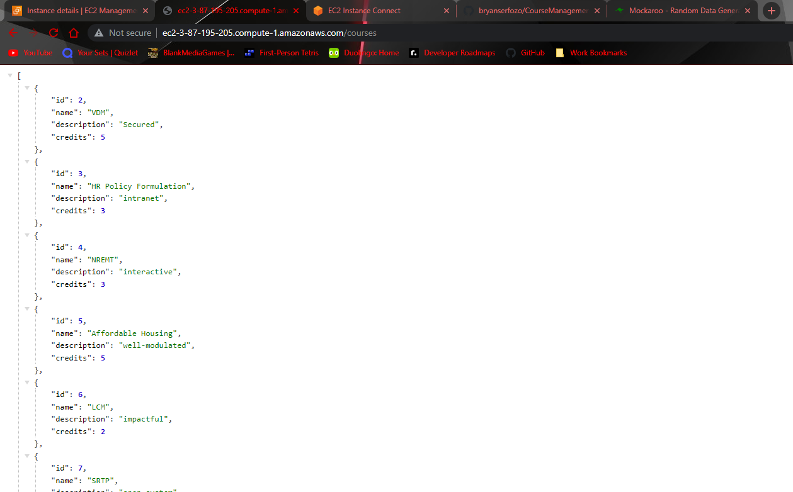

# Deploying Dockerized Spring Boot App to EC2

Deploying the backend of your application on an EC2 is generally a straightforward process. There are a few steps though and if you need to update something in your application, this can lead to several iterations of these instructions as you remove the old containers and images only to build new ones, so hopefully when we get to our CI/CD pipeline, life will be a dream since it'll basically do all this for us.

**DISCLAIMER** You can do this before you eventually update your CORS policy for the Angular app though it is **highly** recommended you get the link to the Angular S3 Bucket and update the cors policy before doing the steps below (otherwise you'll just end up doing them again)

1. First thing you need to do is connect to your ec2 instance. I did this through the aws dashboard, though you can do it on the command line too and receive the same results (this makes sense since it's the same ec2 no matter where you connect to it). First thing we're gonna do is install a couple things using yum which is the built in package manager (useful tool for downloading apps with pre-configured setup info, I actually use the scoop package manager for pretty much everything in training since it makes life super easy.) The things we need to install are git (to clone our project repo), maven (this actually also installs java, we need this to package our app into the jar file), and docker to actually build and run the image. Make sure your dockerfile is setup and working correctly on your local machine before attempting all this

Run the following commands
- `sudo yum install git -y`

- `sudo yum install maven -y`

- `sudo yum install docker -y`

Note that the `-y` flags just says you want to say "yes" for any questions that may come up during the install

2. Now we need to get the backend into our ec2. How would you get a project onto your local machine? You would clone it, we're gonna do the same thing here with `git clone`

3. Next, cd into the project directory. From here, we're going to run a `mvn clean package` like we did earlier when dockerizing our spring boot app. We'll use the following full command  `mvn clean -D DB_URL=yourURLhere -D DB_USER=yourUsernameHere -D DB_PASSWORD=yourPasswordHere package`

4. Now since we're using Docker instead of podman there are just a few minor differences we'll note. First is that pretty much before any docker command we'll need to put `sudo` (super-user do) since it needs root level access (we're using this in lieu of podman here for simplicity). The other minor change is that now we need to start the docker daemon, we do this with `sudo service docker start`

5. Since everything is running and ready to go now, we should be able to build and run our image like we did before. We'll start by building the image with `sudo docker build -t name-of-your-image .`

We can always verify this was done correctly with `sudo docker images`

6. Finally, we should be able to run the image for our application just like we did before with `sudo docker run -d -p 80:8080 -e DB_URL=yourURLhere -e DB_USER=yourUsernameHere -e DB_PASSWORD=yourPasswordHere name-of-your-image`. This should start running our app on the ec2. Note that I used port 80 here (optional choice, pick whatever you want I guess) since 80 is the default http port, meaning you can omit it when processing web traffic (i.e. instead of localhost:80 it would just be localhost).

7. Our API is now running, we should be able to access all the same info we did before but now it's hosted on the cloud and no longer on our local machines. We can verify this in our case by going to our of our GET endpoints at the ec2 instance's public address (remember to change it from https to http otherwise it won't work).

